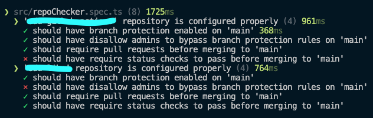

# Repo Checker

Audit repository configuration like security settings and more with unit tests.

## Getting Started

1. Clone the repository.
2. Create a `.env` file by making a copy of `.env.example`.
3. Address all the `FIXME` comments throughout the codebase.
4. Run the command `npm test`.

## Example Usage

